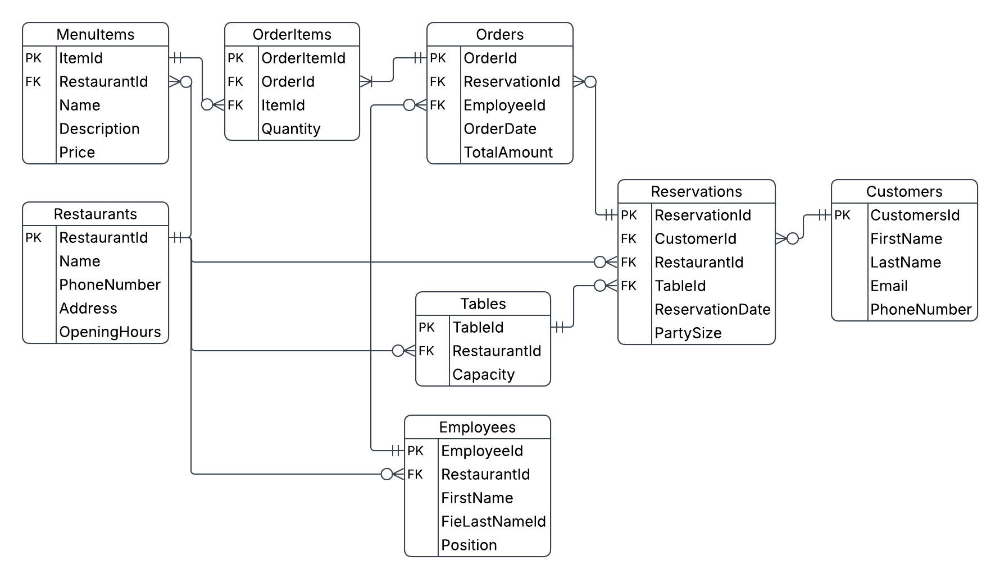

# Restaurant Reservation Management System

A relational database project built with MS SQL Server for managing restaurant operations, including reservations, orders, menu items, employees, and customers.

## Entity Relationship Diagram (ERD)

The database consists of 8 core entities:
- **Restaurants** — restaurant details (name, address, phone, opening hours)
- **Customers** — customer contact information
- **MenuItems** — food items linked to a specific restaurant
- **Employees** — staff members linked to a specific restaurant
- **Tables** — physical tables available at each restaurant
- **Reservations** — customer bookings for a specific table and date
- **Orders** — orders placed during a reservation
- **OrderItems** — individual menu items included in an order

## Relationships

|        Relationship        |     Type      |
|----------------------------|---------------|
| Restaurants → MenuItems    | 1 : 0-or-more |
| Restaurants → Employees    | 1 : 0-or-more |
| Restaurants → Tables       | 1 : 0-or-more |
| Restaurants → Reservations | 1 : 0-or-more |
| Customers → Reservations   | 1 : 0-or-more |
| Tables → Reservations      | 1 : 0-or-more |
| Reservations → Orders      | 1 : 0-or-more |
| Employees → Orders         | 1 : 0-or-more |
| Orders → OrderItems        | 1 : 1-or-more |
| MenuItems → OrderItems     | 1 : 0-or-more |

## Database Schema

Schema and table creation scripts are located in [`schema/create_tables.sql`](schema/create_tables.sql).

Key design decisions:
- All primary keys use `IDENTITY(1,1)` for automatic ID generation
- All Foreign Keys are defined inline within `CREATE TABLE` statements, following table creation order based on dependency (Restaurants and Customers first, followed by dependent tables)
- `Price` and `TotalAmount` use `DECIMAL(10,2)` to preserve currency precision

## Queries

- List reservations for a specific customers.
- List all employees with the Manager position.
- List orders placed for a reservation with their menu items.
- List menu items ordered for a specific reservation.
- Calculate the average order amount processed by a specific employee.
- Created `[Reservations Report]` to display reservation details along with customer and restaurant information.
- Created `[Employees details]` to display employee information along with restaurant details.
- Use a CTE to identify reservations that have two or more orders.
- Rank restaurants by reservation frequency using aggregation.
- Identify the most popular menu item for each restaurant for a given month using joins and window functions.
- Identify the most popular menu item for each restaurant for a given month using joins and window functions.
- Created `fn_CalculateEmployeeSalary` to calculate employee salary based on the number of processed orders and employee position rank.

## Stored Procedures

- Created `sp_ResrvedTablesReport` to retrieve reserved tables within a specified date range.
- Created `sp_AddNewOrder` to validate reservation and employee records before inserting a new order.
- Created `sp_FutureReservedTables` to retrieve all future reserved tables using a temporary table.